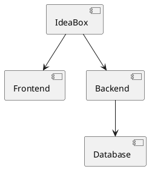

# IdeaBox

[](https://github.com/codecrafters-io/build-your-own-x)
[](https://github.com/apollo4labs/IdeaBox/stargazers)
[](./LICENSE)
[](https://github.com/apollo4labs/IdeaBox/commits/main)

> A curated collection of application and startup ideas — organized by topic, documented in depth, ready to build.

## What I cannot create, I do not understand — Richard Feynman

IdeaBox is a structured repository for capturing, organizing, and developing application and startup concepts. Each idea is documented with detailed markdown files and visual diagrams so you can explore, iterate, and eventually build your vision.

### Quick Stats

| Ideas | Topics | Diagrams | Status |
|-------|--------|----------|--------|
| 9 | 5 | 16 | Concept |

---

## Table of Contents

- [What's Inside](#whats-inside)
- [Idea Structure](#idea-structure)
- [Topics](#topics)
- [Explore Ideas](#explore-ideas)
- [Adding an Idea](#adding-an-idea)
- [Diagrams](#diagrams)
- [Contributing](#contributing)
- [Sponsor](#sponsor)
- [Resources](#resources)

---

## What's Inside

Every idea in IdeaBox follows a consistent format. Each one captures the full arc from problem to implementation:

- **README.md** — Overview, status, and one-liner
- **problem.md** — What problem does it solve?
- **solution.md** — How does it solve this problem?
- **target-users.md** — Who are the users?
- **business-model.md** — How does it make money?
- **architecture.md** — System design and technical approach
- **mvp.md** — Minimum viable product scope
- **tech-stack.md** — Technology stack and development roadmap
- **diagrams/** — Architecture and user flow diagrams (PlantUML)

---

## Idea Structure

```
IdeaBox/
├── topics/
│   ├── ai/
│   ├── saas/
│   ├── mobile/
│   ├── desktop/
│   └── decentralized/
├── templates/
│   └── idea/README.md        # Standard template for new ideas
├── tools/
│   └── diagrams/             # PlantUML and Draw.io files
└── examples/                 # Completed or well-documented examples
```

### Each Idea Contains

| File | Purpose |
|------|---------|
| `README.md` | Overview, status, and one-liner |
| `problem.md` | What problem does it solve? |
| `solution.md` | How does it solve this problem? |
| `target-users.md` | Who are the users? |
| `business-model.md` | How does it make money? |
| `architecture.md` | System design and technical approach |
| `diagrams/` | Draw.io / PlantUML diagrams (user flows, architecture) |
| `mvp.md` | Minimum viable product scope |
| `tech-stack.md` | Technology stack and development roadmap |

---

## Topics

| Topic | Description | Ideas |
|-------|-------------|-------|
| [Decentralized](./topics/decentralized/README.md) | Self-sovereign infrastructure and privacy-respecting systems | 1 |
| [Desktop](./topics/desktop/README.md) | Desktop applications and system utilities | 1 |
| [Mobile](./topics/mobile/README.md) | Mobile application concepts | 4 |
| [SaaS](./topics/saas/README.md) | Software-as-a-Service concepts | 2 |
| [AI](./topics/ai/README.md) | AI-powered applications | 1 |

---

## Explore Ideas

### Decentralized & Privacy

#### Anonymous Decentralized Chat

> A censorship-resistant messenger where every user runs their own node, messages route through Tor, and identity is a cryptographic onion address — no accounts, no central server, no public IP required.

**Status:** Concept
**Folder:** [topics/decentralized/anonymous-chat/](./topics/decentralized/anonymous-chat/)

A peer-to-peer anonymous chat network where each user hosts a lightweight homeserver as a Tor onion service. Messages are routed through the Tor network, identities are derived from keypairs, and no central authority can track, block, or take down the system. Built in Rust with embedded Tor (arti), Ed25519 identity, and offline message queuing.

- **Key features:** Tor-native routing, invite-and-key bootstrap, offline message queue, self-hosted nodes
- **Catalyst:** European Chat Control 2.0 — the architecture makes compliance technically unenforceable

### Desktop

#### Living City Live Wallpaper

> A dynamic, context-aware desktop wallpaper: a living medieval city that builds, farms, and evolves over the day — driven by local time, weather, and seasons — then "burns down" and rebuilds fresh each evening.

**Status:** Concept
**Folder:** [topics/desktop/living-city-wallpaper/](./topics/desktop/living-city-wallpaper/)

### Mobile

#### HabitStack

> A micro-habits app focused on building routines in 2-minute increments with gamified streaks and social accountability.

**Status:** Concept
**Folder:** [topics/mobile/habitstack/](./topics/mobile/habitstack/)

#### LocalMesh

> A peer-to-peer local communication and resource-sharing app for events, communities, and offline-first scenarios.

**Status:** Concept
**Folder:** [topics/mobile/localmesh/](./topics/mobile/localmesh/)

#### ArcVia Browser

> A lightning-fast, thumb-friendly Android browser that combines Arc's reachable UI and space-focused design with Via's sub-second page loads and custom 120Hz spring physics — no bloat, no frame drops.

**Status:** Concept
**Folder:** [topics/mobile/arcvia-browser/](./topics/mobile/arcvia-browser/)

#### StreamHub

> One app to browse, search, and launch anything across every streaming service — a unified, subscription-aware catalog with cross-provider watchlists and one-tap deep links that open titles directly inside Netflix, Disney+, Max, Prime Video, or Apple TV+.

**Status:** Concept
**Folder:** [topics/mobile/streamhub/](./topics/mobile/streamhub/)

### SaaS

#### Smart Task Prioritizer

> An intelligent task management tool that uses machine learning to automatically prioritize your daily tasks based on deadlines, importance, energy levels, and dependency graphs.

**Status:** Concept
**Folder:** [topics/saas/smart-task-prioritizer/](./topics/saas/smart-task-prioritizer/)

#### API-First Analytics Dashboard

> A fully API-driven analytics platform designed for developers, with customizable widgets, real-time data streaming, and seamless integration with any data source.

**Status:** Concept
**Folder:** [topics/saas/api-analytics-dashboard/](./topics/saas/api-analytics-dashboard/)

### AI

#### AI Productivity Assistant

> An intelligent AI-powered assistant designed to streamline workplace productivity by automating routine tasks and providing intelligent workflow optimization.

**Status:** Concept
**Folder:** [topics/ai/](./topics/ai/)

---

## Adding an Idea

Create a new folder under `topics/YOUR_TOPIC/` with the standard idea documentation structure:

```bash
mkdir -p topics/YOUR_TOPIC/my-idea/diagrams
cd topics/YOUR_TOPIC/my-idea/
# Create markdown files for your idea
```

See `templates/idea/README.md` for the full template.

### Diagrams

Use Draw.io for visual diagrams and save as `.drawio` or export as SVG/PNG.
Use PlantUML for technical architecture diagrams:



---

## Contributing

Contributions are welcome! If you have an idea you'd like to add, or want to improve the documentation:

1. Fork the repository
2. Create a feature branch
3. Add your idea following the [template](./templates/idea/README.md)
4. Commit and push
5. Open a pull request

Each contribution helps build a comprehensive collection of entrepreneurial concepts.

---

## Sponsor

If IdeaBox is useful to you, consider [sponsoring](.github/SPONSORS.md) to help keep the list alive, maintained, and ad-free.

---

## Resources

- **build-your-own-x** — A curated list of guides for re-creating technologies from scratch: https://github.com/codecrafters-io/build-your-own-x
- **public-api-lists** — A hand-curated list of free public APIs: https://github.com/public-api-lists/public-api-lists

---

*Started on 2026-08-27* — Continuously updated with new ideas and improvements.