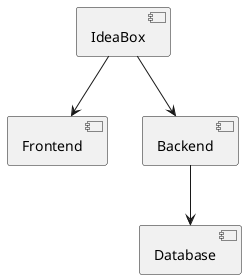

# IdeaBox

_A curated collection of application and startup ideas — organized by topic, ready to explore._

## What It Is

IdeaBox is a structured repository for capturing, organizing, and developing application and startup concepts. Each idea is documented with detailed markdown files and visual diagrams to help you explore, iterate, and eventually build your vision.

Think of it as a "idea farm" where every potential product has:
- **Clear documentation** (what problem it solves, target users, business model)
- **Architecture diagrams** (system design, user flows, technology stacks)
- **Implementation notes** (technical approach, MVP strategy, development roadmap)

## Structure

The repository is organized hierarchically:

```
IdeaBox/
├── topics/              # Major topic categories
│   ├── saas/           # Software-as-a-Service ideas
│   ├── mobile/         # Mobile app concepts
│   ├── ai/             # AI-powered applications
│   └── hardware/       # Physical products/internet of things
├── templates/           # Standard document templates for ideas
├── tools/
│   ├── diagrams/       # Draw.io and PlantUML diagram files
│   └── scripts/        # Development and automation scripts
└── examples/           # Completed or well-documented example ideas
```

### Each Idea Contains

Every idea lives in its own folder under `topics/`:

**Core Files:**
- `README.md` — Brief overview and current status
- `problem.md` — What problem does it solve?
- `solution.md` — How does it solve this problem?
- `target-users.md` — Who are the users?
- `business-model.md` — How does it make money?

**Architecture & Design:**
- `architecture.md` — System design and technical approach
- `diagrams/` — Draw.io/PlantUML diagrams (user flows, system architecture)

**Development:**
- `mvp.md` — Minimum viable product scope
- `tech-stack.md` — Technology stack and development roadmap

## Usage

### Adding a New Idea

```bash
mkdir -p topics/YOUR_TOPIC/
cd topics/YOUR_TOPIC/
# Create markdown files for your idea
mkdir -p diagrams
# Add your diagrams in drawio/plantuml format
```

### Working with Diagrams

Use Draw.io for visual diagrams and save as `.drawio` or export as SVG/PNG.
Use PlantUML for technical architecture diagrams:



### Example Ideas

See `examples/` for completed or well-documented ideas to understand the format.

## Why This Structure?

1. **Clarity**: Each idea has a dedicated space with clear documentation
2. **Scalability**: Organize ideas by topic, status, or priority as the collection grows
3. **Implementation**: Includes both conceptual design and practical implementation notes
4. **Collaboration**: Easy to share and iterate with others
5. **Searchability**: Markdown files are easy to search and index

## Tools & Software

- **Documentation**: Markdown (.md files)
- **Diagrams**: Draw.io, PlantUML
- **Version Control**: Git, GitHub
- **Organization**: Hierarchical folder structure

## Getting Started

1. Explore the existing examples to understand the format
2. Add your first idea to the `topics/` directory
3. Document both the concept and practical implementation details
4. Use diagrams to visualize your architecture and user flows

## Future Enhancements

- Automated validation of idea completeness
- Idea scoring and prioritization system
- Integration with project management tools
- Template generation for new ideas
- Export capabilities for idea presentations

---

*Started on 2026-08-27* — Continuously updated with new ideas and improvements.*

## Contributing

Feel free to add your own ideas or improve the structure. Each contribution helps build a comprehensive collection of entrepreneurial concepts.